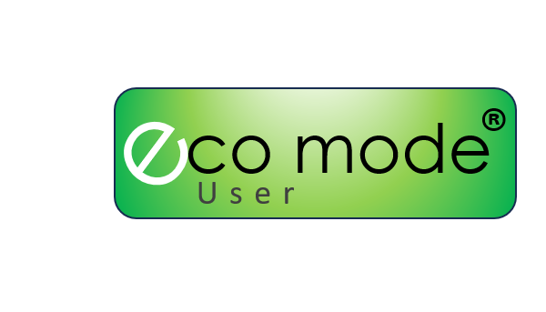
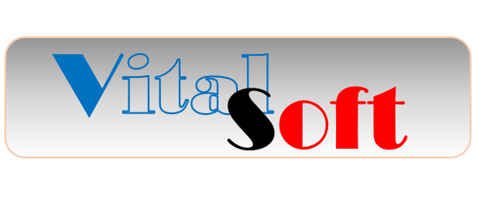

  
  
  
  
  

# VitalSoft

Welcome to **VitalSoft**  an organization dedicated to building open source software that empowers everyone, especially those with low-end devices and limited resources.

## Our Mission

VitalSoft creates free and open source tools designed to run efficiently on devices with limited RAM and CPU power. We believe technology should be accessible to all, regardless of hardware constraints or ability to pay.

## Contributing

We welcome contributors of all experience levels! Whether you're a developer, designer, tester, or advocate, your input is vital. Here’s how you can help:

- **Code**: Improve existing tools or start new projects.
- **Documentation**: Help make our projects easier to use and understand.
- **Testing**: Spot bugs, optimize performance, and ensure compatibility with low-end hardware.
- **Community**: Share feedback, ideas, and real-world experiences.

Check out our [Contributing Guide](CONTRIBUTING.md) to get started.

## Our Tools

All VitalSoft projects are:

- **Open Source**: Free to use, modify, and distribute.
- **Lightweight**: Designed to work on devices with limited RAM and CPU power.
- **User-Focused**: Built by listening to the needs of our end users.

Explore our repositories to find tools that make a difference!

## Listening to End Users

Your voice matters. We actively seek feedback from users to guide our priorities and development. Join our discussions, open issues, or reach out on our community channels.

## License

All VitalSoft software is released under a free and open license. See individual repositories for details.

---

**Together, we can make software that works for everyone.**  
VitalSoft, Open source. Lightweight. User-driven.
